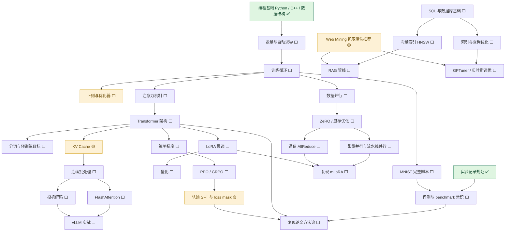

# 学习路线 · 技能树

不是单线：**六个支柱 + 一张依赖图**。有些技能可以并行推，有些必须先解锁前置。
状态：✅ 已掌握 · 🟡 在学 · ⬜ 未开始

---

## 依赖图



同一张图的文字版（README 上看不了 Mermaid 时用）：

```
编程基础 ✅
└─ 张量与自动求导 ⬜ ─ 训练循环 ⬜ ─┬─ MNIST 脚本 ⬜
                                  ├─ 正则与优化器 ⬜
                                  ├─ 注意力机制 ⬜ ─ Transformer ⬜ ─┬─ 分词/预训练目标 ⬜
                                  │                                   ├─ LoRA 微调 ⬜ ─ 量化 ⬜
                                  │                                   ├─ 策略梯度 ⬜ ─ PPO/GRPO ⬜ ─ 轨迹SFT与loss mask 🟡
                                  │                                   └─ KV Cache 🟡 ─ 连续批处理 ⬜ ─┬─ FlashAttention ⬜
                                  │                                                                      └─ 投机解码 ⬜
                                  │                                                                          └─ vLLM 实战 ⬜
                                  ├─ 数据并行 ⬜ ─ ZeRO/显存 ⬜ ─┬─ 张量/流水线并行 ⬜ ─┐
                                  │                              └─ 通信 AllReduce ⬜ ─┴─ 复现 mLoRA ⬜
                                  └─ SQL/数据库 ⬜ ─┬─ 索引与查询优化 ⬜ ─ GPTuner ⬜
                                                    ├─ 向量索引 HNSW ⬜ ─ RAG 管线 ⬜
                                                    └─ Web Mining 🟡 ─┘
实验记录规范 ✅ ─ 评测与 benchmark ⬜ ─ 复现论文方法论 ⬜
```

---

## 每个技能点的通关标准（跑不出东西就不算学会）

### A. 深度学习地基（所有支线的前提）

| 技能 | 前置 | 状态 | 通关标准（产出物） | 资源 |
|---|---|---|---|---|
| 张量与自动求导 | Python | ⬜ | 能手写 `requires_grad` 的小例子，说清 backward 在算什么 | d2l 第 2 章 |
| 训练循环 | 张量 | ⬜ | 不看教程写出 loss → backward → step 的循环 | d2l 第 3 章 |
| MNIST 完整脚本 | 训练循环 | ⬜ | 训练 + 测试准确率都跑出来，代码进仓库 | d2l 第 3–4 章 |
| 正则与优化器 | 训练循环 | ⬜ | 能对比"有无 dropout/weight decay"的过拟合曲线 | d2l 第 4 章 |
| 交叉熵与 loss mask | 训练循环 | 🟡 | 能解释 `labels=-100` 为什么不参与损失 | HF 文档 |

### B. Transformer 与大模型

| 技能 | 前置 | 状态 | 通关标准 | 资源 |
|---|---|---|---|---|
| 注意力机制 | 训练循环 | ⬜ | 手推 attention 的 Q/K/V 矩阵形状 | d2l 第 10 章 |
| Transformer 架构 | 注意力 | ⬜ | 能画出 encoder/decoder 结构并讲清残差 + LayerNorm 位置 | 李沐 Transformer 精读 |
| 分词与预训练目标 | Transformer | ⬜ | 说清 BPE 怎么切词、下一 token 预测与掩码语言模型差别 | d2l 第 14 章 |
| LoRA 微调 | Transformer | ⬜ | 在自备小数据上微调一个 0.5B 模型跑通 | LoRA 论文 + PEFT |
| 量化 | LoRA | ⬜ | 用 4-bit 加载模型并对比显存与速度 | GPTQ/AWQ 文档 |

### C. Agent 与强化学习

| 技能 | 前置 | 状态 | 通关标准 | 资源 |
|---|---|---|---|---|
| 策略梯度 | Transformer | ⬜ | 说清 policy / reward / advantage 的关系 | 李宏毅 RL |
| PPO / GRPO | 策略梯度 | ⬜ | 讲清 GRPO 为什么不需要 critic | GRPO 原论文 |
| 轨迹 SFT 与 loss mask | PPO/GRPO | 🟡 | 把 *Don't Mask the Environment* 的公式 (1) 手推一遍 | 论文笔记 |

### D. 推理系统

| 技能 | 前置 | 状态 | 通关标准 | 资源 |
|---|---|---|---|---|
| KV Cache | Transformer | 🟡 | 讲清省了什么、代价是什么 | 已写笔记 |
| 连续批处理 | KV Cache | ⬜ | 说清静态批处理为什么浪费显存 | vLLM 博客 |
| FlashAttention | 连续批处理 | ⬜ | 讲清"分块 + 重算"换显存的思路 | 原论文 + 图解 |
| 投机解码 | 连续批处理 | ⬜ | 说清 draft 模型与接受率 | 论文 |
| vLLM 实战 | 以上 | ⬜ | 本地/云上起服务，测吞吐与显存 | vLLM 文档 |

### E. 训练系统与分布式

| 技能 | 前置 | 状态 | 通关标准 | 资源 |
|---|---|---|---|---|
| 数据并行 | 训练循环 | ⬜ | 说清梯度为什么要 AllReduce | ZeRO 讲解 |
| ZeRO / 显存优化 | 数据并行 | ⬜ | 讲清三阶段各切了什么 | ZeRO 论文 |
| 张量并行与流水线并行 | ZeRO | ⬜ | 说清两者切分维度不同、通信模式不同 | Megatron 文档 |
| 通信 AllReduce | ZeRO | ⬜ | 讲清 Ring AllReduce 的通信量 | 分布式训练综述 |
| 复现 mLoRA | 并行 + LoRA | ⬜ | 跑通并写一页复现笔记 | mLoRA 仓库 |

### F. 数据与检索（AI4DB / RAG）

| 技能 | 前置 | 状态 | 通关标准 | 资源 |
|---|---|---|---|---|
| SQL 与数据库基础 | — | ⬜ | 能写多表连接与聚合查询 | SQLBolt |
| 索引与查询优化 | SQL | ⬜ | 说清 B+ 树索引为什么能加快范围查询 | CMU 15-445 |
| 向量索引 HNSW | 索引 | ⬜ | 说清近似最近邻的"图 + 跳层"思路 | 论文 + Faiss 文档 |
| RAG 管线 | 向量索引 + Web Mining | ⬜ | 搭一个能回答自己文档问题的小系统 | 实践项目 |
| Web Mining | — | 🟡 | 抓一个静态站 → 清洗成 CSV | 已写笔记 |
| GPTuner / 贝叶斯调优 | 索引 + 概率统计 | ⬜ | 跑通 demo，讲清为什么能用贝叶斯优化 | GPTuner 仓库 |

### G. 工程与可复现（贯穿始终）

| 技能 | 前置 | 状态 | 通关标准 |
|---|---|---|---|
| 实验记录规范 | — | ✅ | 笔记五段式（要解决什么 / 怎么跑 / 结果 / 踩坑 / 没搞懂） |
| 评测与 benchmark 常识 | MNIST 脚本 | ⬜ | 说清 pass@k、温度、熵的含义 |
| 复现论文方法论 | Transformer + 轨迹 SFT | ⬜ | 能列出"复现一篇论文"的检查清单 |

---

## 现在站的位置

- **已通关**：编程基础、环境与工具链、实验记录规范
- **在学**：KV Cache、Web Mining、轨迹 SFT 与 loss mask（读论文中）
- **下一步解锁**：张量与自动求导 → 训练循环

## 两条可以并行的线

1. **主线（能力堆叠）**：A 地基 → B Transformer → C Agent/RL
   —— 这条决定你能不能看懂论文、能不能进组干活。
2. **副线（动手爽感）**：F 数据与检索 或 D 推理系统
   —— 不需要等主线走完，随手做小项目（抓数据、起个推理服务），保持手感。

**不要同时开三条以上**，这是本科生做科研最常见的死法：与其样样浅尝，不如一条线走通。
