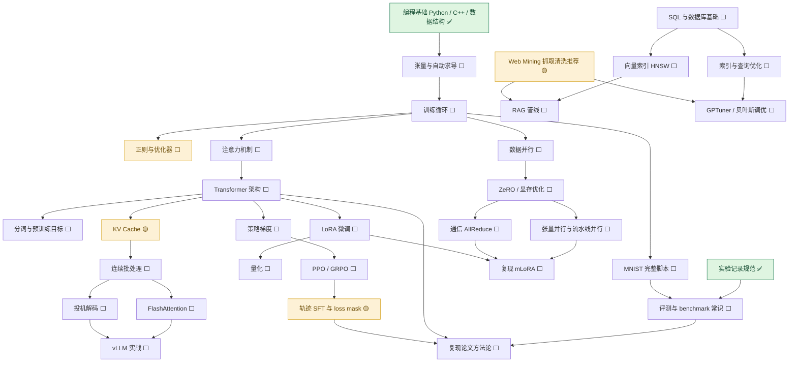

# 学习路线 · 技能树

不是单线：**六个支柱 + 一张依赖图**。有些技能可以并行推，有些必须先解锁前置。
状态：✅ 已掌握 · 🟡 在学 · ⬜ 未开始

> 所有链接 **2026-09-21 逐个验活**（HTTP 200）。HF 系域名国内直连不通，统一给 `hf-mirror.com` 镜像。

---

## ★ 当前首要任务：进实验室（2026-09-23 起，优先级最高）

> **目标**：2027 年暑假前进入实验室（首选唐明洁 IDS Lab），**并带着一份自主成果过去**。
> **理由**：论文（一作 100 / 二作 60）与大创（65–85）加分都以"进组"为前提；名额收紧的形势下，科研经历是你唯一的短板。

| 周次 | 时间 | 做什么 | 产出物 |
|---|---|---|---|
| W1–2 | 9/23–10/7 | 工具链补齐：Git、租云 GPU（AutoDL），跑通 `torch.cuda.is_available()` | 云 GPU 截图进仓库 |
| W3–6 | 10/8–11/4 | PyTorch 基础：张量 → 自动求导 → 训练循环 → DataLoader | **不看教程手写 MNIST 训练脚本** |
| W7–10 | 11/5–12/2 | Transformer + 训练/推理系统基础（Prefill/Decode、KV Cache、显存账、量化、梯度检查点） | 概念笔记 + 一次显存实测算账 |
| W11–14 | 12/3–12/30 | **复现 mLoRA**（小规模、单卡可跑） | 可运行的复现仓库 |
| W15–18 | 1/1–1/27（寒假） | **消融 2–3 组**：改一处、看一处，找出一个别人没明说的现象 | 实验表格 + 结论 |
| W19–22 | 1/28–2/24 | 写成 **4–6 页技术报告**（背景/方法/实验/发现/局限） | **报告 + 开源仓库（进组材料）** |
| W23–24 | 2/25–3/10 | 给老师发信（附仓库 + 报告）约谈；准备 5 分钟自述 | 联系到 1–2 位老师 |

**并行线（不额外占时间）**：
- **W8 起**：每篇 30 分钟读目标老师的近期论文，只记"他关心什么问题"
- **2027-03-20**：盯大数据挑战赛报名（已设提醒）
- **W23 前必须问清两件事**：① 学院推免加分是否要求**本院教师指导**（影响论文署名）② 大创申报时间窗

**验收标准（敲门的就这三样）**：① 能跑通的开源仓库 ② 一份说清"我发现了什么"的报告 ③ 能把这件事讲 5 分钟、被追问不崩。

---

## 依赖图



文字版（手机上不方便看图时用）：

```
编程基础 ✅
└─ 张量与自动求导 ⬜ ─ 训练循环 ⬜ ─┬─ MNIST 脚本 ⬜
                                  ├─ 正则与优化器 ⬜
                                  ├─ 注意力机制 ⬜ ─ Transformer ⬜ ─┬─ 分词/预训练目标 ⬜
                                  │                                   ├─ LoRA 微调 ⬜ ─ 量化 ⬜
                                  │                                   ├─ 策略梯度 ⬜ ─ PPO/GRPO ⬜ ─ 轨迹SFT与loss mask 🟡
                                  │                                   └─ KV Cache 🟡 ─ 连续批处理 ⬜ ─┬─ FlashAttention ⬜
                                  │                                                                      └─ 投机解码 ⬜
                                  │                                                                          └─ vLLM 实战 ⬜
                                  ├─ 数据并行 ⬜ ─ ZeRO/显存 ⬜ ─┬─ 张量/流水线并行 ⬜ ─┐
                                  │                              └─ 通信 AllReduce ⬜ ─┴─ 复现 mLoRA ⬜
                                  └─ SQL/数据库 ⬜ ─┬─ 索引与查询优化 ⬜ ─ GPTuner ⬜
                                                    ├─ 向量索引 HNSW ⬜ ─ RAG 管线 ⬜
                                                    └─ Web Mining 🟡 ─┘
实验记录规范 ✅ ─ 评测与 benchmark ⬜ ─ 复现论文方法论 ⬜
```

---

## 每个技能点的通关标准（跑不出东西就不算学会）

### A. 深度学习地基（所有支线的前提）

| 技能 | 前置 | 状态 | 通关标准（产出物） | 资源 |
|---|---|---|---|---|
| 张量与自动求导 | Python | ⬜ | 能手写 `requires_grad` 的小例子，说清 backward 在算什么 | [动手学深度学习 · 第 2 章](https://zh-v2.d2l.ai/) |
| 训练循环 | 张量 | ⬜ | 不看教程写出 loss → backward → step 的循环 | [d2l 第 3 章](https://zh-v2.d2l.ai/) · [PyTorch 60 分钟闪电战](https://pytorch.org/tutorials/beginner/deep_learning_60min_blitz.html) |
| MNIST 完整脚本 | 训练循环 | ⬜ | 训练 + 测试准确率都跑出来，代码进仓库 | [d2l 第 3–4 章](https://zh-v2.d2l.ai/) |
| 正则与优化器 | 训练循环 | ⬜ | 能对比"有无 dropout / weight decay"的过拟合曲线 | [d2l 第 4 章](https://zh-v2.d2l.ai/) |
| 交叉熵与 loss mask | 训练循环 | 🟡 | 能解释 `labels=-100` 为什么不参与损失 | [CrossEntropyLoss（ignore_index）](https://pytorch.org/docs/stable/generated/torch.nn.CrossEntropyLoss.html) |

### B. Transformer 与大模型

| 技能 | 前置 | 状态 | 通关标准 | 资源 |
|---|---|---|---|---|
| 注意力机制 | 训练循环 | ⬜ | 手推 attention 的 Q/K/V 矩阵形状 | [d2l 第 10 章](https://zh-v2.d2l.ai/) |
| Transformer 架构 | 注意力 | ⬜ | 能画出 encoder/decoder 结构，讲清残差与 LayerNorm 的位置 | [李沐 B 站（论文精读系列）](https://space.bilibili.com/1567748478) · [原论文](https://arxiv.org/abs/1706.03762) |
| 分词与预训练目标 | Transformer | ⬜ | 说清 BPE 怎么切词、下一 token 预测与掩码语言模型的差别 | [d2l 第 14 章](https://zh-v2.d2l.ai/) |
| LoRA 微调 | Transformer | ⬜ | 在自备小数据上微调一个 0.5B 模型跑通 | [LoRA 论文](https://arxiv.org/abs/2106.09685) · [PEFT 文档（镜像）](https://hf-mirror.com/docs/peft/index) |
| 量化 | LoRA | ⬜ | 用 4-bit 加载模型，对比显存与速度 | [GPTQ](https://arxiv.org/abs/2210.17323) · [AWQ](https://arxiv.org/abs/2306.00978) |

### C. Agent 与强化学习

| 技能 | 前置 | 状态 | 通关标准 | 资源 |
|---|---|---|---|---|
| 策略梯度 | Transformer | ⬜ | 说清 policy / reward / advantage 的关系 | [李宏毅 机器学习 2023 春](https://speech.ee.ntu.edu.tw/~hylee/ml/2023-spring.php) |
| PPO / GRPO | 策略梯度 | ⬜ | 讲清 GRPO 为什么不需要 critic | [DeepSeekMath（GRPO 出处）](https://arxiv.org/abs/2402.03300) |
| 轨迹 SFT 与 loss mask | PPO/GRPO | 🟡 | 把公式 (1) 手推一遍 | [Don't Mask the Environment](https://arxiv.org/abs/2609.20715) · [我的论文笔记](notes/20260921_论文_Dont-Mask-the-Environment.md) |

### D. 推理系统

| 技能 | 前置 | 状态 | 通关标准 | 资源 |
|---|---|---|---|---|
| KV Cache | Transformer | 🟡 | 讲清省了什么、代价是什么 | [我的笔记](notes/20260921_KV-Cache.md) |
| 连续批处理 | KV Cache | ⬜ | 说清静态批处理为什么浪费显存 | [Anyscale 连续批处理博客](https://www.anyscale.com/blog/continuous-batching-llm-inference) |
| FlashAttention | 连续批处理 | ⬜ | 讲清"分块 + 重算"换显存的思路 | [原论文](https://arxiv.org/abs/2205.14135) |
| 投机解码 | 连续批处理 | ⬜ | 说清 draft 模型与接受率 | [原论文](https://arxiv.org/abs/2211.17192) |
| vLLM 实战 | 以上 | ⬜ | 起服务，测吞吐与显存 | [vLLM 仓库](https://github.com/vllm-project/vllm) · [文档](https://docs.vllm.ai/) · [PagedAttention 论文](https://arxiv.org/abs/2309.06180) |

### E. 训练系统与分布式

| 技能 | 前置 | 状态 | 通关标准 | 资源 |
|---|---|---|---|---|
| 数据并行 | 训练循环 | ⬜ | 说清梯度为什么要 AllReduce | [ZeRO 论文](https://arxiv.org/abs/1910.02054) · [并行训练综述（Lilian Weng）](https://lilianweng.github.io/posts/2021-09-25-train-large/) |
| ZeRO / 显存优化 | 数据并行 | ⬜ | 讲清三阶段各切了什么 | [ZeRO 论文](https://arxiv.org/abs/1910.02054) |
| 张量并行与流水线并行 | ZeRO | ⬜ | 说清两者切分维度与通信模式的不同 | [Megatron-LM](https://github.com/NVIDIA/Megatron-LM) |
| 通信 AllReduce | ZeRO | ⬜ | 讲清 Ring AllReduce 的通信量 | [并行训练综述](https://lilianweng.github.io/posts/2021-09-25-train-large/) |
| 复现 mLoRA | 并行 + LoRA | ⬜ | 跑通并写一页复现笔记 | [mLoRA 仓库](https://github.com/TUDB-Labs/mLoRA) |

### F. 数据与检索（AI4DB / RAG）

| 技能 | 前置 | 状态 | 通关标准 | 资源 |
|---|---|---|---|---|
| SQL 与数据库基础 | — | ⬜ | 能写多表连接与聚合查询 | [SQLBolt](https://sqlbolt.com/) |
| 索引与查询优化 | SQL | ⬜ | 说清 B+ 树索引为什么加快范围查询 | [CMU 15-445](https://15445.courses.cs.cmu.edu/fall2025/) |
| 向量索引 HNSW | 索引 | ⬜ | 说清近似最近邻的"图 + 跳层"思路 | [HNSW 论文](https://arxiv.org/abs/1603.09320) · [Faiss](https://github.com/facebookresearch/faiss) |
| RAG 管线 | 向量索引 + Web Mining | ⬜ | 搭一个能回答自己文档问题的小系统 | [LangChain RAG 教程](https://python.langchain.com/docs/tutorials/rag/) |
| Web Mining | — | 🟡 | 抓一个静态站 → 清洗成 CSV | [我的笔记](notes/20260921_Web-Mining（网络数据挖掘）.md) · [MMDS 免费电子书](http://www.mmds.org/) |
| GPTuner / 贝叶斯调优 | 索引 + 概率统计 | ⬜ | 跑通 demo，讲清为什么能用贝叶斯优化 | [GPTuner 仓库](https://github.com/SolidLao/GPTuner) |

### G. 工程与可复现（贯穿始终）

| 技能 | 前置 | 状态 | 通关标准 | 资源 |
|---|---|---|---|---|
| 实验记录规范 | — | ✅ | 笔记五段式（要解决什么 / 怎么跑 / 结果 / 踩坑 / 没搞懂） | 本仓库 [README](README.md) 的「记录规范」 |
| 评测与 benchmark 常识 | MNIST 脚本 | ⬜ | 说清 pass@k、温度、策略熵的含义 | [HumanEval（pass@k 出处）](https://arxiv.org/abs/2107.03374) |
| 复现论文方法论 | Transformer + 轨迹 SFT | ⬜ | 能列出"复现一篇论文"的检查清单 | [nanoGPT](https://github.com/karpathy/nanoGPT)（可读的参考实现） |

---

## 竞赛与实战（练兵的入口，不进技能树但别忘）

| 项目 | 时间窗 | 产出目标 | 备注 |
|---|---|---|---|
| **Kaggle 入门赛** | 寒假开始（2027-01-18 已设提醒） | **完整跑通一个赛、不冲奖牌**：一份 notebook + 一篇复盘笔记 | Kaggle 免费给 GPU，正好补"本机无显卡"；**不加综测分**（不在学院名单） |
| **中国高校计算机大赛-大数据挑战赛**（⭐榜单赛事） | 报名 3 月底–7 月中（2027-03-20 已设提醒） | 组**单人队**参赛，提交一次有效结果 + 复盘笔记 | **可以单人组队**、学院认可**算综测**；2026 年赛题＝用历史股价预测未来一周收益最大的股票组合 |
| 蓝桥杯 | 见既有提醒 | —— | 个人赛（已有省三）；视觉艺术设计赛在做 |
| CCSP / 百度之星 | 关注通知 | 想练算法时打 | 都是**个人赛** |

### 大数据挑战赛：从现在到明年 3 月的准备（寒假 → 春季）

| 时间 | 做什么 | 产出 |
|---|---|---|
| **寒假 1–2 月** | `pandas` / `numpy` / `matplotlib`：读 CSV、时间序列、画图 | 一份**数据探索 notebook**（能读出趋势、缺失、异常） |
| **寒假末 – 3 月** | 机器学习基础（scikit-learn 回归）+ **时间序列的坑**：滑窗构造样本、**按时间切训练/验证集**（绝不能随机切）、评价指标 | 跑通一个**回归 baseline** |
| **3 月（报名开窗）** | 读 2026 年官方基准程序 [THU-BDC2026](https://github.com/Sherlock1956/THU-BDC2026) 理解思路；**报名（组单人队）** | baseline 复现 + 报名完成 |
| **4–8 月** | 在每个提交窗口前迭代（4/25、5/30、6/27、8/1 前后） | 每次提交 + 一篇复盘笔记 |

> 和前面对上：这条线练的是**传统 ML + 时间序列**（pandas/sklearn），跟技能树的 PyTorch 主线**互相喂**——先能处理数据，再上深度模型才不虚。

> 纪律：**竞赛只在主线空档期打，一次只开一个**；开打前先写清楚"这次要产出什么"。

## 外部课程地图：CSDIY（csdiy.wiki）取用清单

> 定位：社区维护的高质量 CS 公开课地图（MIT / CMU / Berkeley / 斯坦福 + 中文社区作业整理），有「机器学习系统 / 机器学习编译 / 大语言模型」分区。
> **纪律：它是地图，不是作业。** 一次只取一门，只用"课程链接 + 作业"，配自己的通关标准 —— 不收藏、不贪多。

| 什么时候 | 取什么 | 投入 | 产出（通关标准） |
|---|---|---|---|
| **碎片时间（本月）** | 必学工具：**LaTeX** 入门 + Git 查漏（Docker 扫一眼） | ≤10 小时 | 能用 LaTeX 自己排一份实验报告 |
| **寒假** | **MIT 18.06 线性代数**（配 3Blue1Brown《线性代数的本质》）或 **UCB CS70 离散概率**（与在学课程同步） | 寒假第二档 | 手推矩阵运算；能讲清线代/概率的直觉 |
| **大二下 / 大三** | **CMU 15-445 数据库**（对口 AI4DB）或「并行与分布式系统」分区里的分布式课（对口分布式训练） | 一门一学期 | 跟完作业/项目 |

**两个坑（写在前面，免得又踩）**：
1. 单门课 **20–60 小时**且多为英文作业 → 按它规划全走会吃掉保研主线的时间
2. 它偏**系统/底层**（OS、编译、体系结构占比大）→ 对两三年后的你很值，但**对当下冲计科前 3% 没有直接帮助**

## 现在站的位置

- **当前首要任务**：**准备进实验室**（见文首「★ 当前首要任务」时间表，W1–W24）
- **已通关**：编程基础、环境与工具链、实验记录规范
- **在学**：KV Cache、Prefill/Decode 与推理负载、梯度消失/爆炸与检查点、Web Mining、轨迹 SFT 与 loss mask
- **下一步解锁**：张量与自动求导 → 训练循环（对应时间表 W3–6）

## 两条可以并行的线

1. **主线（能力堆叠）**：A 地基 → B Transformer → C Agent/RL —— 决定你能不能看懂论文、能不能进组干活。
2. **副线（动手爽感）**：F 数据与检索 或 D 推理系统 —— 不必等主线走完，随手做小项目（抓数据、起个推理服务）保持手感。

**纪律**：不要同时开三条以上。与其样样浅尝，不如一条线走通。

---

## 资源索引（全部验活于 2026-09-21）

**书与课程**
- [动手学深度学习（中文 V2，免费在线书）](https://zh-v2.d2l.ai/)
- [李沐 B 站主页](https://space.bilibili.com/1567748478)（《动手学深度学习》配套视频 + 论文精读系列都在这里）
- [PyTorch 60 分钟闪电战](https://pytorch.org/tutorials/beginner/deep_learning_60min_blitz.html) · [PyTorch 中文文档](https://pytorch.apachecn.org/)
- [Karpathy《Zero to Hero》](https://karpathy.ai/zero-to-hero.html)
- [李宏毅 机器学习（2023 春，含 RL / RLHF）](https://speech.ee.ntu.edu.tw/~hylee/ml/2023-spring.php)
- [CMU 15-445 数据库系统](https://15445.courses.cs.cmu.edu/fall2025/) · [SQLBolt](https://sqlbolt.com/)
- [Mining of Massive Datasets（免费电子书）](http://www.mmds.org/)

**论文**
- [Attention Is All You Need](https://arxiv.org/abs/1706.03762) · [LoRA](https://arxiv.org/abs/2106.09685)
- [ZeRO](https://arxiv.org/abs/1910.02054) · [DeepSeekMath / GRPO](https://arxiv.org/abs/2402.03300)
- [FlashAttention](https://arxiv.org/abs/2205.14135) · [PagedAttention / vLLM](https://arxiv.org/abs/2309.06180) · [投机解码](https://arxiv.org/abs/2211.17192)
- [GPTQ](https://arxiv.org/abs/2210.17323) · [AWQ](https://arxiv.org/abs/2306.00978) · [HNSW](https://arxiv.org/abs/1603.09320)
- [HumanEval（pass@k 出处）](https://arxiv.org/abs/2107.03374) · [Don't Mask the Environment](https://arxiv.org/abs/2609.20715)

**代码与文档**
- [nanoGPT](https://github.com/karpathy/nanoGPT) · [mLoRA](https://github.com/TUDB-Labs/mLoRA) · [Megatron-LM](https://github.com/NVIDIA/Megatron-LM)
- [vLLM](https://github.com/vllm-project/vllm) · [Faiss](https://github.com/facebookresearch/faiss) · [GPTuner](https://github.com/SolidLao/GPTuner)
- [Transformers 文档（镜像）](https://hf-mirror.com/docs/transformers/index) · [PEFT 文档（镜像）](https://hf-mirror.com/docs/peft/index)
- [CrossEntropyLoss（`ignore_index=-100` 语义）](https://pytorch.org/docs/stable/generated/torch.nn.CrossEntropyLoss.html)
